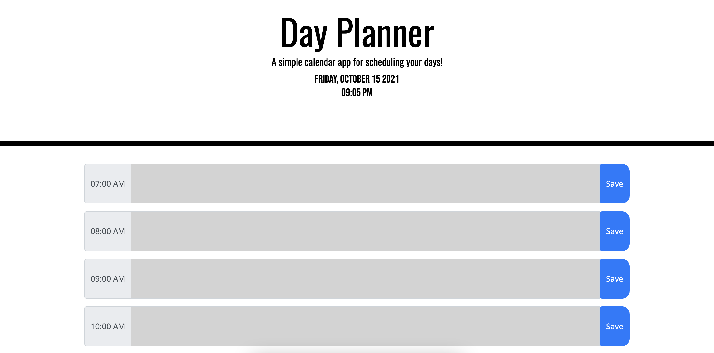
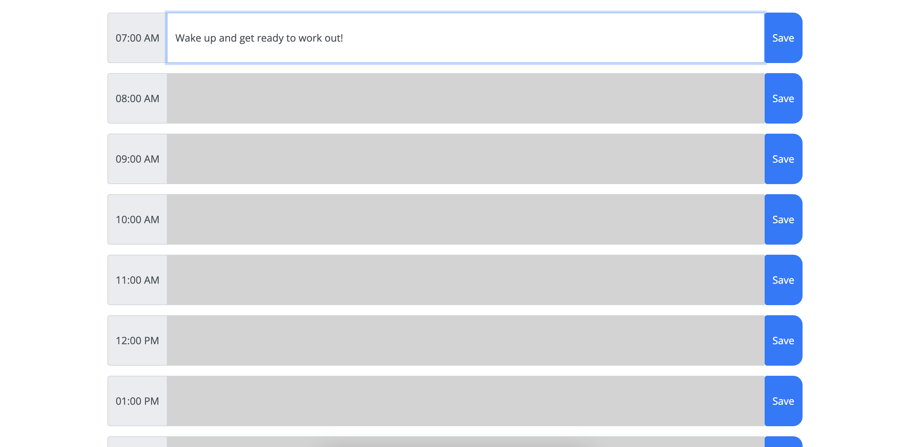
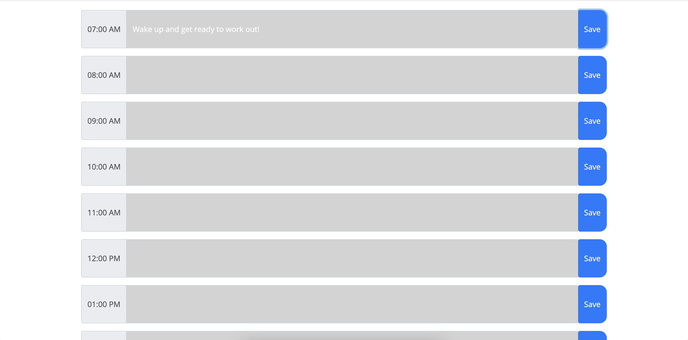

# Day Planner

This project was for my UCSD coding bootcamp. Very fun project using bootstrap and javascript, took a bit of time to figure out the javascript code. 

## Demo & Repository

* [GitHub Repo](https://github.com/latommyla?tab=repositories)
* [GitHub Deployed Live URL](https://latommyla.github.io/Day-Planner/)

## Description

Develop a simple day planner application with saving functions and color coded timeblocks (past, present, & future).

## What was using in this project?

* HTML
* CSS
* JQuery
* Bootstrap

## Installation

To install this project, simply download the zip file or clone the SSH key to your terminal. GitHub has instructions on how to do this.

## How it works? 

* First you will be presented with the title, date, and clock.

* You then will be able to input text into the timeblock of your choosing.

* Then click the 'Save' button to save the inputted text, also will not disappear if you refresh the page.

